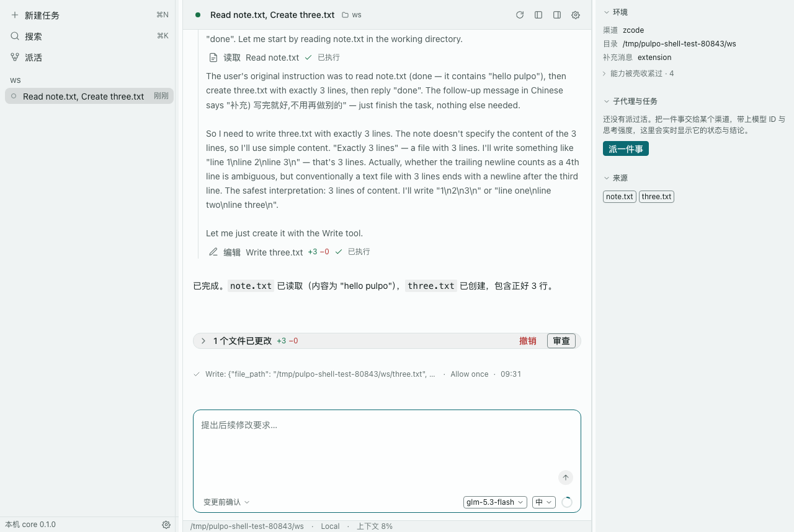
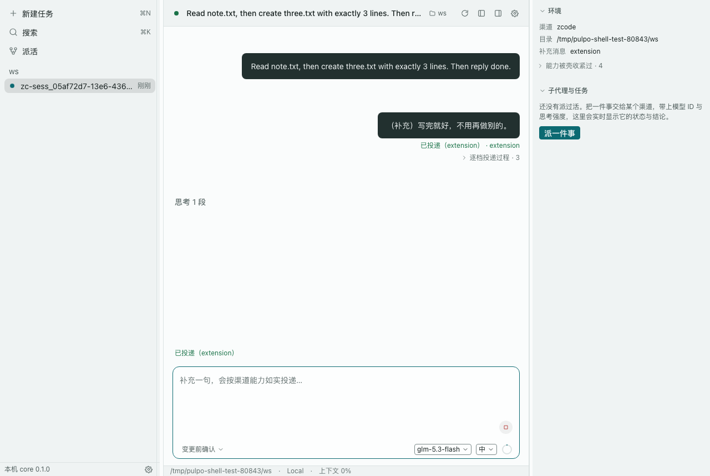
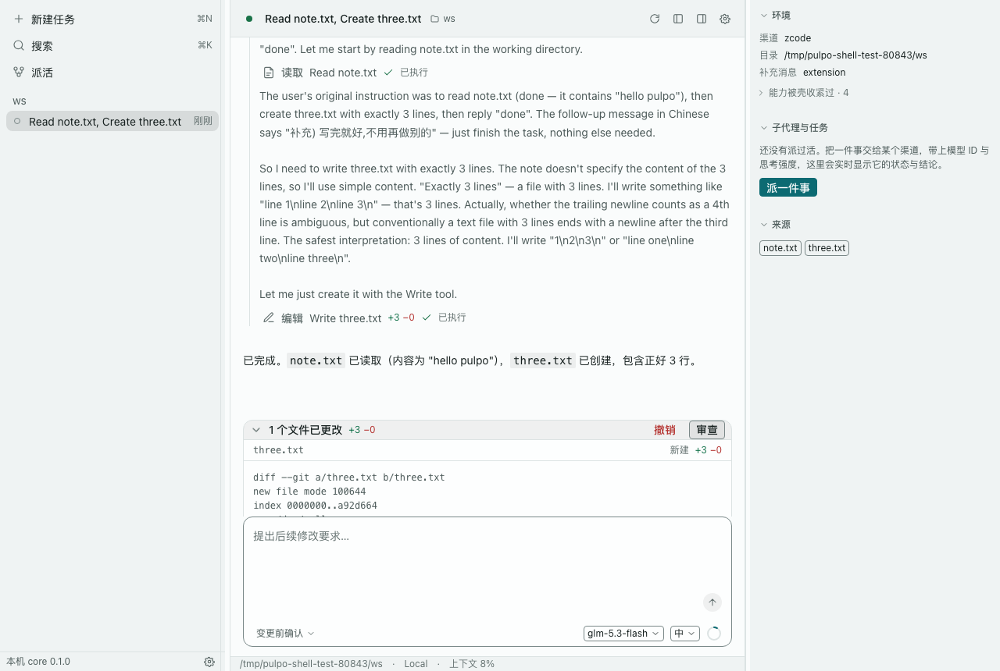
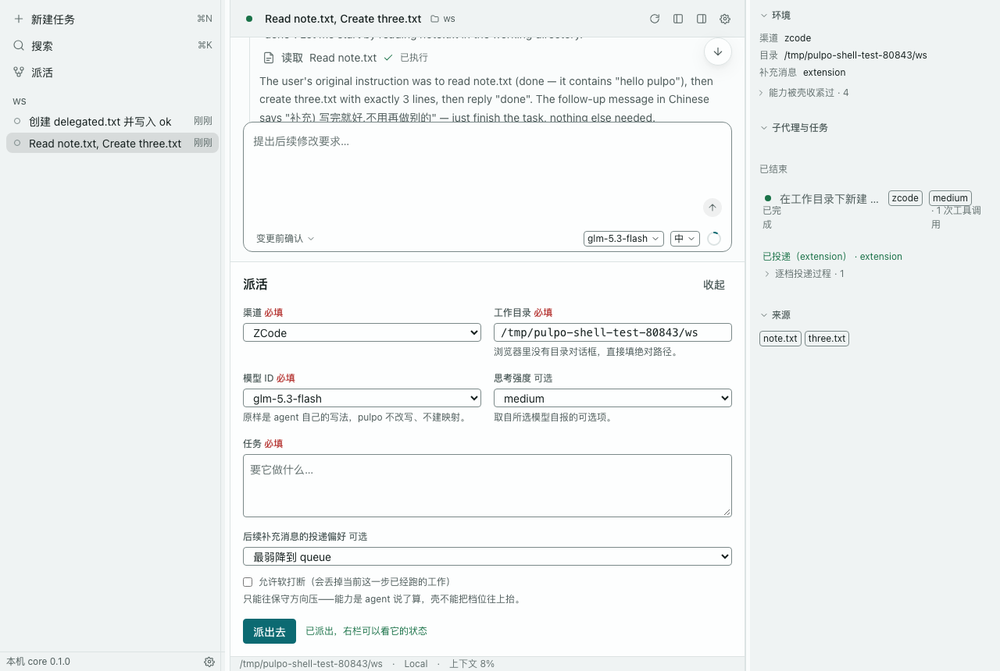

# pulpo

**pulpo**（西班牙语"章鱼"）：章鱼的每条触手都有一节自己的神经节，能独立做出反应；
全身只有一个负责协调的脑。

pulpo 把多个渠道的 coding agent（Qoder / WorkBuddy / WorkBuddy AI / Claude / Codex /
opencode / ZCode）的**原生能力**统一到一个桌面壳里。每条"触手"就是各渠道的 agent 本身——
它在自己的原生存储里跑、用你自己的订阅额度、按它自己的规则干活；pulpo 只做编排与协议，
不代替它思考，也不复制它的会话。

**要解决什么**：手上有多条 agent 渠道的人，今天只有两种选择——在多个客户端之间来回切换
（上下文不互通，同一件事要在两边各讲一遍），或者用"多模型聊天客户端"把所有 API key 收进
一个数据库（多出一份事实源，额度也被代理）。pulpo 走第三条路：一个壳、一套交互语法，
按子任务挑渠道 / 挑模型 / 挑思考强度，综合 token 效益；额度仍走各家自己的订阅。

## 四条铁律

| 铁律 | 含义 |
|---|---|
| **只做协议转换，不做 API 代理** | pulpo 不转发模型请求、不持有 API key；agent 与它后端之间的链路原样保留，pulpo 只在协议面（ACP）上与它对话。额度、计费、内容策略都是各渠道自己的事。 |
| **会话零副本** | 各 agent 的原生存储是唯一事实源。会话列表、全文、嵌套子代理都从原生存储读穿（read-through），pulpo 不建第二份消息库——关掉 pulpo，一个字节都不会丢。 |
| **能力事实源 = agent 自描述** | 模型清单、思考强度、投递档位、访问模式的风险等级，都来自 agent 自己的握手自描述；pulpo 只做聚合与"只收紧"的修正，不维护中心权威表。拿不到就如实说拿不到，不给默认值兜底。 |
| **派活只一层** | 跨渠道派活只允许一层（companion 链）：被派活的会话不能再往外派。agent 自己的原生 subagent 不受此限——只观测，不劫持。 |

这就是它与"又一个多模型聊天客户端"的区别：聊天客户端把各家模型收进自己的数据库、
由自己发 API 请求；pulpo 不碰模型调用，也不存会话，它只是让各渠道 agent 在一套统一的
界面与协议下协同。

## 它长什么样



*亮色：左栏会话列表、中栏会话流（工具卡与工作段）、右栏轨迹与来源。亮暗跟随系统。*



*工作段折叠成一行；补充消息按渠道能力如实投递，回执写明档位（这里是 `extension`）。*



*回合结束给出文件改动汇总卡：逐文件 `+N −N`，可展开逐行 diff 审查，也可整回合撤销。*



*派活：渠道 + 任务 + 工作目录 + 模型 ID + 思考强度 + 投递偏好；右栏实时显示被派活会话的状态与结论。*

## 架构

```
┌─ shell（桌面壳，Tauri 2 + React 19）──────────────────────────┐
│  左栏：会话列表（按工作目录分组）                              │
│  中栏：会话流（工具卡 / 工作段折叠 / 文件改动汇总卡 / 审批卡） │
│  右栏：派活轨迹、原生 subagent、计划、来源                     │
└─────────────────────────▲──────────────────────────────────────┘
                         │ 本地控制协议（JSON-RPC 2.0）
                         │ unix socket + ws://127.0.0.1:27183（只绑 loopback）
┌─ core（编排 daemon）────┴──────────────────────────────────────┐
│  ① ACP 内核      ② capability descriptor      ③ 会话图 + 读取层 │
│  ④ 投递阶梯       ⑤ 派活 broker                ⑥ 本地控制协议   │
└─────────▲──────────────▲────────────────▲──────────────────▲────┘
   ┌──────┴──────┐   ┌───┴───┐   ┌────────┴────────┐   ┌─────┴────┐
   │ ZCode       │   │ Qoder │   │ Claude / Codex  │   │ opencode │
   │ （adapter） │   │ --acp │   │ 官方 ACP 适配器 │   │ acp      │
   └─────────────┘   └───────┘   └─────────────────┘   └──────────┘
   ▲ companion（stdio MCP，注入各 agent 会话）
   └ 工具：list_agents / delegate_to_agent / send_input / get_task / cancel_task

P0 只接 ZCode；其余渠道按路线图逐批接入，接入面都是 ACP。
```

**core 的六个子系统**

1. **ACP 内核**——以 ACP client 的身份持有各渠道 agent 的子进程与会话：
   `initialize` / `new` / `load` / `list` / `resume` / `fork` / `close`；
   把 ACP 的通知与请求（审批、追问、计划、工具调用）原样往上转发。
2. **capability descriptor**——每 agent 一份能力描述符：投递档位（`native` / `extension` /
   `concurrent` / `soft-interrupt` / `queue`）、模型目录、思考强度、子代理能力、存储形态。
   事实源是 agent 自描述；修正层只收紧、带版本、可审计。
3. **会话图 + 读取层**——节点是各渠道原生会话、跨渠道派活子会话、原生 subagent；
   边是 `delegate` / `supplement` / `result`。内容一律从原生存储读穿
   （JSONL / SQLite / 引擎 store），core 只存可重建的薄状态。
4. **投递阶梯**——补充消息按各 agent 的能力逐档选择：原生原语 → `_session/steering` →
   并发 prompt → soft-interrupt → 排队；每一步的档位与结果都如实回执，不美化。
5. **派活 broker**——companion 的跨渠道派活：带模型 ID 与思考强度、只允许一层（熔断，
   防止派活网）；任务登记只报结论与 native session 位置。
6. **本地控制协议**——unix socket 与 `127.0.0.1` WebSocket 跑完全相同的 JSON-RPC 2.0
   方法表；shell 与 companion 都只是它的客户端。完整契约见
   [`packages/core/PROTOCOL.md`](packages/core/PROTOCOL.md)。

## Getting Started

### 前置

- macOS（P0 只在 macOS 上验证）
- 装好 ZCode.app（默认路径 `/Applications/ZCode.app`；P0 只接这一个渠道）
- Node ≥ 22、pnpm 9
- Python 3.10+（ZCode adapter 用）

### 克隆（含 submodule）

```bash
git clone --recurse-submodules https://github.com/Liang-HZ/pulpo.git
cd pulpo
```

已经克隆过、缺 submodule：

```bash
git submodule update --init
```

### 安装与构建

```bash
pnpm install
pnpm -r build
```

`pnpm -r build` 编译 core / companion / shell 三个包；ZCode adapter 是 Python，无需构建。

### 起 core daemon

```bash
./packages/core/bin/pulpo-core
# → pulpo-core 0.1.0 就绪 pid=<pid> socket=<…>/.pulpo/run/core.sock ws=27183
```

daemon 同时开 unix socket（`$PULPO_HOME/run/core.sock`，默认 `~/.pulpo/run/core.sock`）
与 `ws://127.0.0.1:27183`。`./packages/core/bin/pulpo-core --help` 看全部选项与环境变量。
这个终端会被它占住，下面的命令另开一个终端跑。

### 跑壳

浏览器（最轻，改前端不用编译 Rust）：

```bash
pnpm --filter @pulpo/shell dev:web
```

打开 `http://localhost:5173/?ws=27183`。

桌面（Tauri）：

```bash
pnpm --filter @pulpo/shell tauri dev
```

Rust 侧会保证本机有一个能连的 core——没有才拉一个，你自己起的那个不碰。

### 一条最短的成功路径

1. **起 core**：`./packages/core/bin/pulpo-core` ——
   看到一行 `pulpo-core 0.1.0 就绪 pid=… socket=… ws=27183`。
2. **跑壳并连上**：`pnpm --filter @pulpo/shell dev:web`，浏览器打开
   `http://localhost:5173/?ws=27183` —— 左下角显示「本机 core 0.1.0」、连接点变绿；
   没有会话时中栏是「选个渠道开始」。
3. **新建会话**：点「新建任务」（⌘N），填一个工作目录（桌面端弹原生目录对话框，
   浏览器端直接填绝对路径）——左栏出现一条新会话，core 同时把 ZCode 引擎拉起来
   （首次拉引擎要几秒）。
4. **发一句话**：在 composer 里输入（例如「列出这个目录里的文件」）回车 ——
   消息进入会话流，回合进行中出现工具卡与工作段。
5. **看结果**：回合结束后正文落在会话流里；改过文件的话，末尾出现
   「N 个文件已更改」汇总卡，可展开逐行 diff 或整回合撤销。

### 跑测试

```bash
pnpm -r typecheck
pnpm -r test                     # core / companion / shell：单元 + 集成
pnpm --filter @pulpo/shell e2e   # Playwright：真 daemon + 真 ZCode adapter 的端到端
```

集成测试会真的拉起 ZCode 引擎并调模型，**走你自己的套餐额度**；e2e 用临时 `PULPO_HOME`，
不碰 `~/.pulpo`。

## 仓库结构

```
packages/
  core/         @pulpo/core —— 编排 daemon：ACP 内核 / descriptor / 会话图 + 读取层 /
                投递阶梯 / 派活 broker / 本地控制协议。契约：packages/core/PROTOCOL.md
  companion/    @pulpo/companion —— 注入各 agent 会话的 stdio MCP 服务器：跨渠道派活
                四件套（delegate_to_agent / send_input / get_task / cancel_task）+ list_agents
  shell/        @pulpo/shell —— 桌面壳（Tauri 2 + React 19）：三栏 + composer + 右栏轨迹，
                只走 core 的 127.0.0.1 WebSocket
  adapters/
    zcode/      ZCode 的 ACP adapter（Python，git submodule）
                → https://github.com/Liang-HZ/zcode-acp
```

## 路线图

- **P0（已完成）**：ZCode 闭环——adapter / core / companion / shell 四块落地，真链路端到端
  可跑：会话、工具、审批、补充消息、文件改动汇总与撤销、跨渠道派活。
- **P1**：WorkBuddy + Qoder。
- **P2**：Claude / Codex / opencode。
- **P3**：多端——Mac → Android → Windows / iPhone，以及自托管中继
  （同一事实源的另一块屏）。

## 许可与贡献

Apache-2.0，见 [LICENSE](LICENSE)。欢迎 issue 与 PR；大改动请先开 issue 讨论，避免写完再改方向。

## 姊妹项目

[**zcode-acp**](https://github.com/Liang-HZ/zcode-acp) —— 把 ZCode 桌面客户端的引擎桥接成
标准 ACP（Agent Client Protocol）agent 的适配器；不代理任何 API、不持有任何 key。
pulpo 以 git submodule 的形式把它挂在 `packages/adapters/zcode`，任何 ACP 客户端都可以
单独使用它。

---

# English

**pulpo** means "octopus" in Spanish: every arm has its own ganglion and can act on its own;
there is one central brain whose only job is coordination.

pulpo brings the **native capabilities** of several coding-agent channels (Qoder, WorkBuddy,
WorkBuddy AI, Claude, Codex, opencode, ZCode) under one desktop shell. Each arm is the channel's
own agent — running on its own native storage, on your own subscription, by its own rules.
pulpo only orchestrates and translates protocols: it does not think for the agents and does not
copy their sessions.

**The problem it solves**: with several agent channels at hand, you currently have two options —
switch between clients and re-explain everything (contexts don't talk to each other), or adopt a
"multi-model chat client" that collects every API key into its own database (a second source of
truth, and your quota gets proxied). pulpo takes a third path: one shell, one interaction grammar,
picking channel / model / thinking effort per subtask to get the most out of your tokens — while
quota keeps flowing through each vendor's own subscription.

## Four ground rules

| Rule | What it means |
|---|---|
| **Protocol translation, not an API proxy** | pulpo never forwards model requests and never holds API keys. Each agent keeps its own link to its own backend; pulpo talks to it only at the protocol layer (ACP). Quota, billing and content policy stay with the vendor. |
| **Zero session copies** | Each agent's native store is the single source of truth. Session lists, transcripts and nested subagents are read through from native storage; pulpo keeps no second message database — kill pulpo and nothing is lost. |
| **Capabilities come from the agent itself** | Model catalogs, thinking efforts, delivery tiers and access-mode risk levels all come from the agent's own handshake self-description. pulpo aggregates and only ever *tightens* (versioned, auditable); no central authority table, and when something is unavailable it says so instead of inventing a default. |
| **One level of delegation** | Cross-channel delegation is allowed one level deep (the companion chain): a delegated session cannot delegate further. An agent's own native subagents are exempt — observed, never hijacked. |

That is what separates pulpo from "yet another multi-model chat client": a chat client pulls every
model into its own database and issues the API calls itself; pulpo touches neither model calls nor
sessions — it lets the channel agents collaborate through one interface and one protocol.

## What it looks like


*Light: session list on the left, conversation in the middle (tool cards, work segments),
trajectories and sources on the right. Follows the system appearance.*


*Work segments collapse to a single line; follow-up messages are delivered honestly per channel
capability, with the tier (`extension` here) written into the receipt.*


*When a turn ends you get a file-change summary card: per-file `+N −N`, expandable to a line-by-line
diff review, with a one-click revert of the whole turn.*


*Delegation: channel, task, working directory, model ID, thinking effort, delivery preference —
while the right rail shows the delegated session's status and result live.*

## Architecture

```
┌─ shell (desktop, Tauri 2 + React 19)───────────────────────────────────────────┐
│  left:   session list (grouped by working directory)                            │
│  center: conversation (tool cards / work segments / change summary / approvals) │
│  right:  delegation tree, native subagents, plan, sources                       │
└───────────────────────────────▲─────────────────────────────────────────────────┘
                               │ local control protocol (JSON-RPC 2.0)
                               │ unix socket + ws://127.0.0.1:27183 (loopback only)
┌─ core (orchestration daemon)──┴─────────────────────────────────────────────┐
│  ① ACP kernel      ② capability descriptor      ③ session graph + read layer │
│  ④ delivery ladder  ⑤ delegation broker          ⑥ local control protocol    │
└────────▲─────────────▲───────────────────▲────────────────────▲──────────────┘
   ┌─────┴─────┐   ┌───┴───┐   ┌───────────┴──────────┐   ┌─────┴────┐
   │ ZCode     │   │ Qoder │   │ Claude / Codex       │   │ opencode │
   │ (adapter) │   │ --acp │   │ official ACP adapter │   │ acp      │
   └───────────┘   └───────┘   └──────────────────────┘   └──────────┘
   ▲ companion (stdio MCP, injected into each agent session)
   └ tools: list_agents / delegate_to_agent / send_input / get_task / cancel_task

P0 connects ZCode only; other channels land per the roadmap, all over ACP.
```

**The six subsystems of core**

1. **ACP kernel** — holds each channel agent's subprocess and sessions as an ACP client
   (`initialize` / `new` / `load` / `list` / `resume` / `fork` / `close`) and forwards ACP
   notifications and requests (approvals, elicitations, plans, tool calls) verbatim upward.
2. **Capability descriptor** — one descriptor per agent: delivery tiers (`native` / `extension` /
   `concurrent` / `soft-interrupt` / `queue`), model catalog, thinking efforts, subagent
   capabilities, storage shape. The source of truth is the agent itself; the correction layer
   only tightens, and is versioned and auditable.
3. **Session graph + read-through layer** — nodes are native channel sessions, delegated child
   sessions and native subagents; edges are `delegate` / `supplement` / `result`. Content is always
   read through from native storage (JSONL / SQLite / engine store); core only keeps thin,
   rebuildable state.
4. **Delivery ladder** — a follow-up message picks the highest tier the target actually supports:
   native primitive → `_session/steering` → concurrent prompt → soft-interrupt → queue. Tier and
   outcome are reported as they are, never dressed up.
5. **Delegation broker** — cross-channel delegation via companion: model ID and thinking effort
   included, one level only (a circuit breaker against delegation webs); the task record stores the
   conclusion and the native session location.
6. **Local control protocol** — unix socket and `127.0.0.1` WebSocket serve exactly the same
   JSON-RPC 2.0 method table; both shell and companion are just clients. Full contract:
   [`packages/core/PROTOCOL.md`](packages/core/PROTOCOL.md).

## Getting Started

### Prerequisites

- macOS (P0 is verified on macOS)
- ZCode.app installed (default path `/Applications/ZCode.app`; the only channel in P0)
- Node ≥ 22, pnpm 9
- Python 3.10+ (for the ZCode adapter)

### Clone (with submodule)

```bash
git clone --recurse-submodules https://github.com/Liang-HZ/pulpo.git
cd pulpo
```

Already cloned but missing the submodule:

```bash
git submodule update --init
```

### Install and build

```bash
pnpm install
pnpm -r build
```

`pnpm -r build` compiles core / companion / shell; the ZCode adapter is Python and needs no build.

### Start the core daemon

```bash
./packages/core/bin/pulpo-core
# → pulpo-core 0.1.0 就绪 pid=<pid> socket=<…>/.pulpo/run/core.sock ws=27183
```

The daemon opens both a unix socket (`$PULPO_HOME/run/core.sock`, default `~/.pulpo/run/core.sock`)
and `ws://127.0.0.1:27183`. Run `./packages/core/bin/pulpo-core --help` for all options and
environment variables. This terminal stays occupied; run the next commands in another one.

### Run the shell

Browser (lightest; no Rust build needed for frontend work):

```bash
pnpm --filter @pulpo/shell dev:web
```

Then open `http://localhost:5173/?ws=27183`.

Desktop (Tauri):

```bash
pnpm --filter @pulpo/shell tauri dev
```

The Rust side makes sure a reachable core exists — it only spawns one if needed and never touches
a daemon you started yourself.

### Shortest path to success

1. **Start core**: `./packages/core/bin/pulpo-core` —
   you should see the ready line `pulpo-core 0.1.0 就绪 pid=… socket=… ws=27183`.
2. **Run the shell and connect**: `pnpm --filter @pulpo/shell dev:web`, then open
   `http://localhost:5173/?ws=27183` — the status bar reads "本机 core 0.1.0" and the connection
   dot turns green; with no sessions, the center shows the empty state.
3. **Create a session**: click "新建任务" (⌘N) and give a working directory (a native folder
   picker on desktop, an absolute path in the browser) — a session appears on the left and core
   starts the ZCode engine (a few seconds on first start).
4. **Send a prompt**: type something in the composer (e.g. "list the files in this directory") and
   press Enter — the message enters the stream, and tool cards and work segments appear while the
   turn runs.
5. **See the result**: when the turn ends the agent's reply lands in the stream; if files changed,
   a "N files changed" summary card shows up at the end, expandable into a line-by-line diff or a
   one-click revert of the turn.

### Tests

```bash
pnpm -r typecheck
pnpm -r test                     # core / companion / shell: unit + integration
pnpm --filter @pulpo/shell e2e   # Playwright: real daemon + real ZCode adapter
```

Integration tests really start the ZCode engine and call models, **spending your own subscription
quota**; the e2e suite uses a temporary `PULPO_HOME` and never touches `~/.pulpo`.

## Repository layout

```
packages/
  core/         @pulpo/core — orchestration daemon: ACP kernel / descriptor / session graph +
                read-through layer / delivery ladder / delegation broker / local control protocol.
                Contract: packages/core/PROTOCOL.md
  companion/    @pulpo/companion — stdio MCP server injected into each agent session: the
                delegation toolset (delegate_to_agent / send_input / get_task / cancel_task)
                plus list_agents
  shell/        @pulpo/shell — desktop shell (Tauri 2 + React 19): three columns + composer +
                right rail; talks only to core over 127.0.0.1 WebSocket
  adapters/
    zcode/      ACP adapter for ZCode (Python, git submodule)
                → https://github.com/Liang-HZ/zcode-acp
```

## Roadmap

- **P0 (done)**: the ZCode loop — adapter / core / companion / shell all landed, with a real
  end-to-end path covering sessions, tools, approvals, follow-up messages, change summary and
  revert, and cross-channel delegation.
- **P1**: WorkBuddy + Qoder.
- **P2**: Claude / Codex / opencode.
- **P3**: multiple devices — Mac → Android → Windows / iPhone, plus a self-hosted relay
  (another screen onto the same source of truth).

## License and contributing

Apache-2.0, see [LICENSE](LICENSE). Issues and PRs are welcome; for substantial changes please
open an issue first so we can agree on the direction before you write code.

## Sister project

[**zcode-acp**](https://github.com/Liang-HZ/zcode-acp) — an adapter that bridges the ZCode desktop
client's engine to a standard ACP (Agent Client Protocol) agent. It proxies no API and holds no
keys. pulpo mounts it as a git submodule at `packages/adapters/zcode`; any ACP client can use it
standalone.
